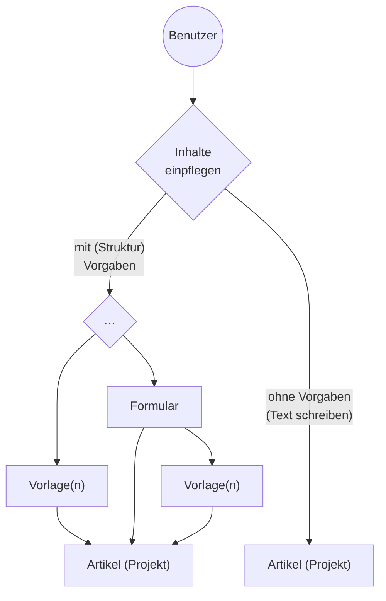
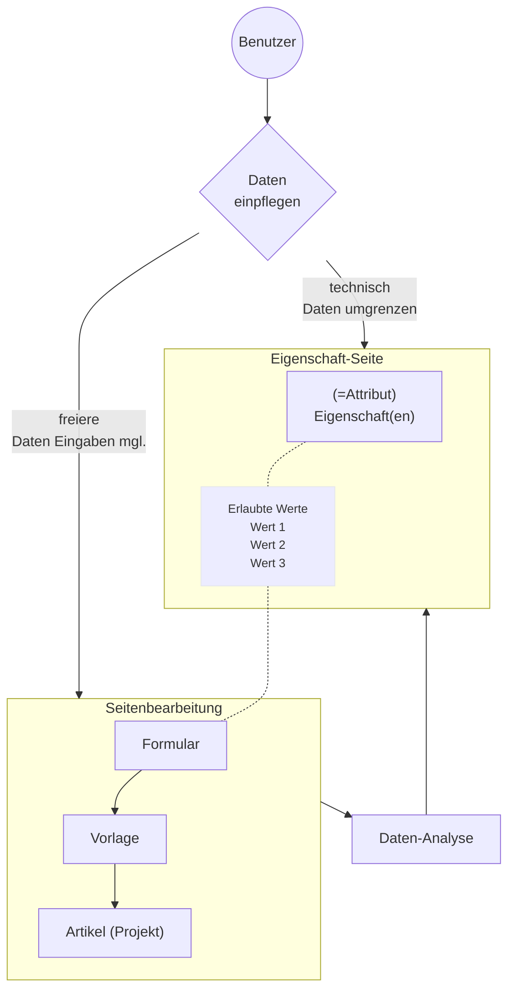

Die Funktionalität ist derzeit grundlegend auf <https://sandbox.oh-dc.org> umgesetzt, dort lassen sich auch weitere Wiki-Code-Verbesserungen realisieren.

# Häufig gestellte Fragen (HGF) / Frequently Asekd Questions (FAQ)

## Wie kommt die Funktionalität der Projektverwaltung ins Wiki?

Das MediaWiki-System ist funktionell erweitert um 

- Formulare, Vorlagen und semantische Eigenschaten (Erweiterungen PageForms und SemanticMediaWiki)
- Systemseiten
- Extension:HtmlSpecialFunctions

Die Hauptfunktionalitäten liegen in den Vorlagen und Formularen, und Extension:HtmlSpecialFunctions enthält einige Funktionshelfer, z.B. bei CSV-Stücklisten o.a.. Derzeit können die nötigen MediaWiki-Seiten über `Special:Import` importiert werden:

- Sandbox-Category-Examples-20230912095126.xml 
- Sandbox-Forms-Templates-Properties-20230912095628.xml
- Sandbox-MediaWiki-System-Pages-20230912095415.xml

Wichtig nach dem Import ist, daß der Wartungsdienst (`runJobs.php`) richtig und regelmäßig läuft, damit die neuen Eigenschaften ordentlich im Wiki zur Funktion kommen.

ZUTUN: Theoretisch könnte man auch eine JSON-Pakt-Definition mit allen Seitenabhängigkeiten erstellen und dann mit der [Extension:PageExchange](https://www.mediawiki.org/wiki/Extension:Page_Exchange) in ein Wiki importieren.

## Wie ändert man die Projekt-Kategorien?

Die Projekt-Kategorien sind verschachtelt aufgebaut, die definierte Oberkategorie im Englischen Wiki ist Projects. Die Verschachtelung kann beliebig tief aufgebaut werden, z.B.:

```
+---------------------------------+
0-Ebene 
↓   1-Unterebene
↓   ↓   2-Unterebene
↓   ↓   ↓
↓   ↓   ↓
+---------------------------------+
Projects
    Agriculture, forest‎
    Business, industry‎
    Computer, electronics‎
    Environmental technologies‎
    Health‎
        Drinking water treatment
        Recycling‎
        Waste water
    Mobility, Logistics‎
    Renewable energies‎
```

Beim Aufbau muß eine Unterkategorie auf die nächst höhere Kategorie verweisen, und die nächsthöhere Kategorie auf die nächsthöhere usw. – jenachdem, wieviele Stufen man haben will, der letzte Verweis *muß* auf die Hauptkategorie “category: Projects” verweisen, denn von ihr aus wird ein Kategorienbaum erzeugt, der dann auch im Erstellungsformular angezeigt eingebunden wird. Seitenbeispiel:

```
+-- Seite category:Projects ------+
|   (dies ist die Hauptkategorie) | ←.
|                                 |   \
|                                 |   ↑
|                                 |   ↑
+---------------------------------+   ↑
                                      ↑
+-- Seite category:Health‎ --------+   /
|                    .→→→→→→→→→→→ | →
|                   /             |
| [[category: Projects]]          | ←.
+---------------------------------+   \
                                      ↑
+-- Seite category:Waste water  --+   ↑
|                                 |   ↑
|                                 |   /
| [[category: Health]]            | →
+---------------------------------+
```

## Wie andert man die Auswahlliste eines Formularfeldes?

Am besten im Wiki-Code nachschauen (`Form:Project`), dann gibt es 2 Möglichkeiten:

1. das Formularfeld hat die Werte fest einprogrammiert, z.B. das Feld `licence` mit `{{{field|licence|input type=dropdown|values=AL,BSDL,CCU,CCBY20,CCBY30,CCBY40,…,UNLIC|mapping template=LabelGralLicense}}}`, dann die Werte bei `values=…` ändern, oder
2. das Formularfeld übernimmt die tatsächlichen Werte eigenständig aus einer Eigenschaft (property), z.B. `{{{field|typeproject|input type=dropdown|property=Typeproject}}}` das “`property=Typeproject`”. 

Im Falle (2) muß man auf der Eigenschaft-Seite die sog. erlaubten Werte `[[allowed values::…]]` neu beschreiben. Dieser Fall hat den Vorteil, daß die Datenüberwachung von SemanticMediaWiki unstimmige Werte in den Vorlagen-Daten ausweist, diese können tatsächlich falsche Werte sein, oder Werte, die noch nicht berücksichtigt wurden und als neuer erlaubter Wert definiert werden sollten (siehe die Eigenschaft `Property:Has_improper_value_for` z.B. https://sandbox.oh-dc.org/wiki/Property:Has_improper_value_for)

Weiteführende Dokumenation:

- Englische Hilfeseite https://www.semantic-mediawiki.org/wiki/Help:Special_property_Allows_value


## Wie wird die programm-technische Dokumenation zusammengehalten?

Die `[[category: Project management]]` sollte alle nötigen technischen Seiten zusammenfassen, die für die Funktionalität wichtig sind, das sind vorrangig:

- Vorlagen (templates)
- Formulare (forms)
- Eigenschaften (Attribute, properties)

Neue Vorlagen sollten auch innerhalb `[[category: Project management]]` dokumentiert werden.

# Technische Anmerkungen und allgemeine Empfehlungen

## Allgemein Beachtenswertes beim Einpflegen

**Nachvollziehbarkeit von Änderungen**

:heavy_check_mark: Kurze Zusammenfassung bei Seitenänderungen beigeben, dies erleichtert das Mitlesen, z.B.: Was wurde geändert usw..

**Übertragbarkeit**

:question: Läßt sich Wiki-Code einwandfrei in andere Systeme übertragen? Lieber Standard-Wiki-Elemente verwenden (Listen, Tabellen, Gallerie usw.) statt ausgklügelter und nur im Einzelfall funktionierender HTML-Code

**Verständlichkeit**

:question: Ist der Code, die Vorlagenbeiwerte (Parameter) verständlich?

- Im Zweifel: Lieber ausführlicher und verständlich, z.B. statt `kw` besser `keyword` o.ä. ausgeschrieben

:pencil: Verständlicher Code, ergänzende Code-Zwischenkommentare `<!-- … -->` helfen falls nötig – die hohe Kunst ;-)

## Gestaltung Vorlagen-Formulare-Eigenschaften

Ein Hauptziel bei Vorlagenprogrammierung dürfte sein, die Beiwerte (Parameter) und die Benennung selbst so klar und selbsterklärend wie nur möglich zu erstellen:

- vermeide: Mischung Deutscher und Englischer Benennung, z.B. `template:Projekt`
- vermeide: Nummerierung ohne Dokumentation `template:Projekt2` – _unklar_ was meint 2 hier?

## Inhalte in Wikiseiten einpflegen

Wichtig ist, daß die Inhalte gut übertragbar und verständlich bleiben sollten:

- möglichst _immer_ eine **kurze Zusammenfassung** gemachter Änderungen zum Abspeichern einer Seite beigeben, dadurch wird der Änderungsverlauf viel leichter auffindbar und nachvollziehbar

Elemente möglichst (nur) in ihrer Grundstruktur verwenden: Absatz, Überschrift, Bild, Listen mit Stichpunkten oder ordentliche Aufzählung, Tabelle usw.

- soweit wie möglich nur Standard-Wiki Elemente verwenden
- was wie eine Tabelle aussehen soll, z. B. linke Spalte, rechte Spalte, sollte auch als (Standard)Tabelle formatiert bleiben (den Rest kann man meist mit CSS Klassen hübscher machen)
- sparsam mit kompliziertem HTML, z.B. `<div style="…"><div style="…"></div></div>`, was über CSS Klassen umformatiert wird zu einer Zweispalten-Tabelle vermeiden, nur wo dringend nötig und unumgänglich

### Bilder

Statt komplizierte `<div>[[File:…|…]]</div>` …

- lieber `<gallery></gallery>`
- oder `<gallery mode="packed"></gallery>` verwenden

Statt `<div class="search_item_img">[[File:…|frameless]]</div>` …

- lieber die CSS Klasse innerhalb des Wiki-Elementes einsetzen `[[File:…|frameless|class=search_item_img]]` und dieses dann definieren in
  - MediaWiki:Common.css (für _alle_ Benutzeroberflächen) oder
  - MediaWiki:Chamaeleon.css (für Chamäleon/Bootstrapp) oder
  - MediaWiki:Vector.css (für klassische Benutzeroberfläche Vector)

### Formulare

Zusammenspiel von Eigenschaften und Formularefeld sollte man bevorzugen (`[[allowed value::…]]` auf der Seite der `Property:…`):

- Anzeigewerte eines Formularfeldes, daß semantische Eigenschaften haben soll, besser auf der Property-Seite so einstellen, daß die Werte auf der Property-Seite automatisch ins Forumlarfeld übernommen werden
  - alt: `{{{field|parameter name1|input-type=…|values=Youtube,Web,…}}}`
  - neu: auf Property:Typeproject `[[Allows value::Youtube]]` + im Formular `{{{field|parameter name1|input-type=dropdown|property=Typeproject}}}`

### Lesbarkeit von Code

Allgemein siehe https://www.mediawiki.org/wiki/Manual:Coding_conventions

## Massenweises ersetzen von Texten

Auf [Special: MassEditRegex](https://www.oh-dc.org/wiki/Special:MassEditRegex) kann jeder Administrator, oder wer `masseditregexeditor` ist, mehrere Seiten gleichzeitig durchsuchen lassen und Textschnippsel ersetzen; Beispiel die Sprachen-Verknüpfungen (`|projectnameES=…`)

1. wir brauchen die Liste der Seitennamen
2. über [Special:ExpandTemplates](https://www.oh-dc.org/wiki/Special:ExpandTemplates) können, was uns die Liste an Seiten ergibt, die wahrscheinlich das zu löschende `|projectnameES=…` enthalten: wir `#ask` ausführen lassen:

   ```plaintext
   {{#ask: [[Projectname::~**]]
    |sep=<br>
    |format=plainlist
    |searchlabel=
    |outro=<br>(…usw. nur als Beispiel)
    |link=none}}
   ```
3. dann [Special: MassEditRegex](https://www.oh-dc.org/wiki/Special:MassEditRegex) oben diese Ergebnisliste der Seiten eintragen
4. Ersetzung eintragen
5. Ersetzung mit Vorschau (preview) anzeigen, was passieren würde wenn ...
6. dann _tatsächlich_ ausfüheren lassen + Zusammenfassung (summary) eintragen, was gelöscht werden wird

### Ersetzungsbeispiel

Beispiel 1: Löschen vollständiger (ganzer) Zeilen mit `|projectnameES=…` oder `|projectnameDE=…`:

| Search for: | Replace with: |
|-------------|---------------|
| `/\n\|projectnameES=(.*)/` |  |
| `/\n\|projectnameDE=(.*)/` |  |

### Vorlagenbeiwerte (Parameter) nachhaltig umschreiben

1. Vorlagen-Code so schreiben, daß der alte Vorlagenbeiwert ausgeführt wird (im Code) aber nicht mehr dokumentiert ist z.B. \
   alt: `{{{kewords|}}}` \
   neu: `{{{keywords|{{{kewords|}}}}}}`
2. Formular-Code umschreiben, falls Formular diesen Vorlagenbeiwert enthält z.B. \
   alt: `{{{field|kewords|…}}}` \
   neu: `{{{field|keywords|…}}}`
3. Danach auf allen Seiten die alten Beiwerte auf den entsprechenden Wikiseiten ersetzen (siehe [Abschnitt massenweises Ersetzen](#massenweises-ersetzen-von-texten))

Auf diese Weise würden alte reinkopierte Vorlagen noch funktionieren, aber bei Bearbeitung im neuen Formular wird nur der neue Beiwert eingepflegt, der alte Wert muß in jedem Falle händisch ersetzt werden, damit auf Formularebene der richtige Wert im richtigen Feld steht.

## Massenweise Seiten löschen

Umfangreiche Seitenlöschungen am besten in der Befehlszeile durchführen:

1. Seitenliste zusammentragen und in eine Textdatei (Zeilenende Unix/Linux) schreiben
2. diese Textdatei dem Verwaltungsskript `deleteBatch.php` übergeben

Beispiel in der Befehlszeile:

```bash
sudo -u www-user php ./maintenance/deleteBatch.php  \
  --conf LocalSettings.php \
  --r "Lösche Unter-Kategorien für Projekte; belasse Hauptkategorien" \
  --u "ein-definierter-Administrator" Löschliste_Projekt-Kategorien_ohne_Projekt-Hauptkategorien_20230831.txt
# …
# Category:Workbenches 2 Deleted!
# Category:Workshop equipment Deleted!
# Category:Workshop gauges Deleted!
# Category:X-ray equipment Deleted!
# …
```

## Systemseiten

### Menüs und Navigation

Bei der Benutzeroberfläche Chameleon (es nutzt Bootstrap v4.0) wird das Hauptmenü durch `MediaWiki:Sidebar` gesteuert und danach erstellt, die dort verschachtelten Listen-Einträge ergeben das Hauptmenü und/oder Untermenüs.

Vertiefende technische Dokumentation siehe [mediawiki.org/wiki/Manual:Interface/Sidebar](https://www.mediawiki.org/wiki/Manual:Interface/Sidebar).

**Hauptseite** definieren:

- `MediaWiki:Mainpage`

## Allgemeinverständnis Vorlagen, Formulare, Artikelseite

Vorlagen dienen dazu, die (vorgegebene) Struktur in Artikelseiten einzupflegen:



Diese Vorlagen können dann vermittels Formulare überarbeitet werden. In der Vorlage selbst ist der ganze Programm-Code für die Gestaltung enthalten und der Benutzer gibt idealerweise nur bestimmte Werte im Formular an, die das Aussehen und den Inhalt der Seite dann ändern.


