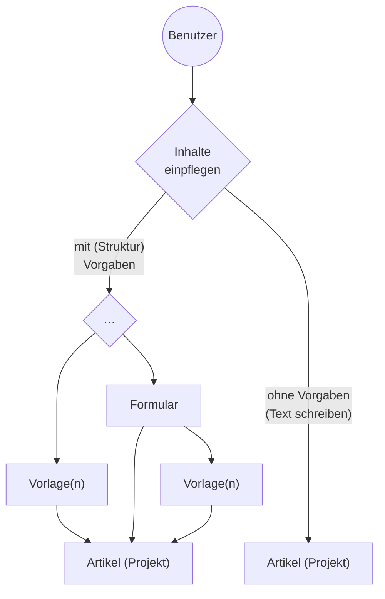
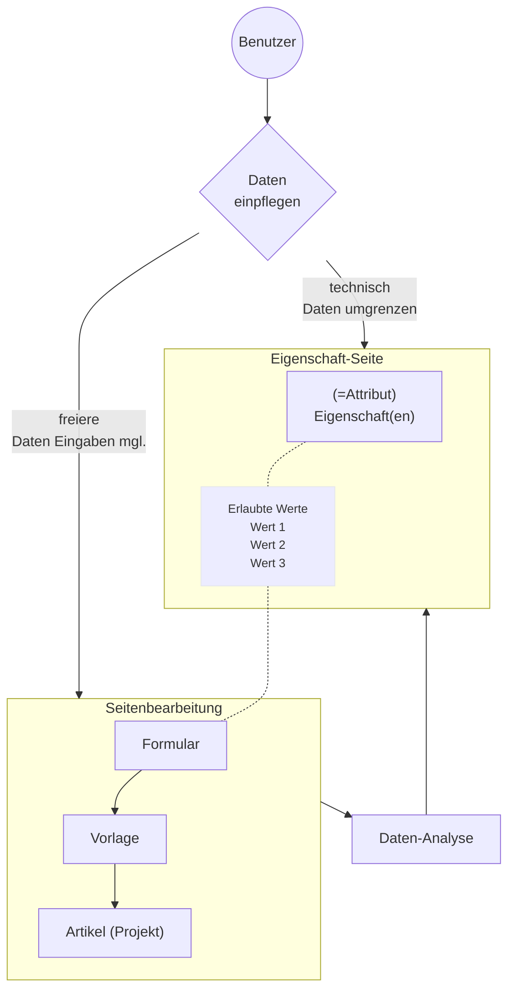

Die Funktionalität ist derzeit grundlegend auf <https://sandbox.oh-dc.org> umgesetzt, dort lassen sich auch weitere Wiki-Code-Verbesserungen realisieren.

# Häufig gestellte Fragen (HGF) / Frequently Asekd Questions (FAQ)

## Wie kommt die Funktionalität der Projektverwaltung ins Wiki?

Das MediaWiki-System ist funktionell erweitert um 

- Formulare, Vorlagen und semantische Eigenschaten (Erweiterungen PageForms und SemanticMediaWiki)
- Systemseiten
- Extension:HtmlSpecialFunctions

Die Hauptfunktionalitäten liegen in den Vorlagen und Formularen, und Extension:HtmlSpecialFunctions enthält einige Funktionshelfer, z.B. bei CSV-Stücklisten o.a.. Derzeit können die nötigen MediaWiki-Seiten über `Special:Import` importiert werden:

- Sandbox-Category-Examples-20230912095126.xml 
- Sandbox-Forms-Templates-Properties-20230912095628.xml
- Sandbox-MediaWiki-System-Pages-20230912095415.xml

Wichtig nach dem Import ist, daß der Wartungsdienst (`runJobs.php`) richtig und regelmäßig läuft, damit die neuen Eigenschaften ordentlich im Wiki zur Funktion kommen.

ZUTUN: Theoretisch könnte man auch eine JSON-Pakt-Definition mit allen Seitenabhängigkeiten erstellen und dann mit der [Extension:PageExchange](https://www.mediawiki.org/wiki/Extension:Page_Exchange) in ein Wiki importieren.

## Wie ändert man die Projekt-Kategorien?

Die Projekt-Kategorien sind verschachtelt aufgebaut, die definierte Oberkategorie im Englischen Wiki ist Projects. Die Verschachtelung kann beliebig tief aufgebaut werden, z.B.:

```
+---------------------------------+
0-Ebene 
↓   1-Unterebene
↓   ↓   2-Unterebene
↓   ↓   ↓
↓   ↓   ↓
+---------------------------------+
Projects
    Agriculture, forest‎
    Business, industry‎
    Computer, electronics‎
    Environmental technologies‎
    Health‎
        Drinking water treatment
        Recycling‎
        Waste water
    Mobility, Logistics‎
    Renewable energies‎
```

Beim Aufbau muß eine Unterkategorie auf die nächst höhere Kategorie verweisen, und die nächsthöhere Kategorie auf die nächsthöhere usw. – jenachdem, wieviele Stufen man haben will, der letzte Verweis *muß* auf die Hauptkategorie “category: Projects” verweisen, denn von ihr aus wird ein Kategorienbaum erzeugt, der dann auch im Erstellungsformular angezeigt eingebunden wird. Seitenbeispiel:

```
+-- Seite category:Projects ------+
|   (dies ist die Hauptkategorie) | ←.
|                                 |   \
|                                 |   ↑
|                                 |   ↑
+---------------------------------+   ↑
                                      ↑
+-- Seite category:Health‎ --------+   /
|                    .→→→→→→→→→→→ | →
|                   /             |
| [[category: Projects]]          | ←.
+---------------------------------+   \
                                      ↑
+-- Seite category:Waste water  --+   ↑
|                                 |   ↑
|                                 |   /
| [[category: Health]]            | →
+---------------------------------+
```

## Wie andert man die Auswahlliste eines Formularfeldes?

Am besten im Wiki-Code nachschauen (`Form:Project`), dann gibt es 2 Möglichkeiten:

1. das Formularfeld hat die Werte fest einprogrammiert, z.B. das Feld `licence` mit `{{{field|licence|input type=dropdown|values=AL,BSDL,CCU,CCBY20,CCBY30,CCBY40,…,UNLIC|mapping template=LabelGralLicense}}}`, dann die Werte bei `values=…` ändern, oder
2. das Formularfeld übernimmt die tatsächlichen Werte eigenständig aus einer Eigenschaft (property), z.B. `{{{field|typeproject|input type=dropdown|property=Typeproject}}}` das “`property=Typeproject`”. 

Im Falle (2) muß man auf der Eigenschaft-Seite die sog. erlaubten Werte `[[allowed values::…]]` neu beschreiben. Dieser Fall hat den Vorteil, daß die Datenüberwachung von SemanticMediaWiki unstimmige Werte in den Vorlagen-Daten ausweist, diese können tatsächlich falsche Werte sein, oder Werte, die noch nicht berücksichtigt wurden und als neuer erlaubter Wert definiert werden sollten (siehe die Eigenschaft `Property:Has_improper_value_for` z.B. https://sandbox.oh-dc.org/wiki/Property:Has_improper_value_for)

Weiteführende Dokumenation:

- Englische Hilfeseite https://www.semantic-mediawiki.org/wiki/Help:Special_property_Allows_value


## Wie wird die programm-technische Dokumenation zusammengehalten?

Die `[[category: Project management]]` sollte alle nötigen technischen Seiten zusammenfassen, die für die Funktionalität wichtig sind, das sind vorrangig:

- Vorlagen (templates)
- Formulare (forms)
- Eigenschaften (Attribute, properties)

Neue Vorlagen sollten auch innerhalb `[[category: Project management]]` dokumentiert werden.

## Allgemeinverständnis Vorlagen, Formulare, Artikelseite

Vorlagen dienen dazu, die (vorgegebene) Struktur in Artikelseiten einzupflegen:



Diese Vorlagen können dann vermittels Formulare überarbeitet werden. In der Vorlage selbst ist der ganze Programm-Code für die Gestaltung enthalten und der Benutzer gibt idealerweise nur bestimmte Werte im Formular an, die das Aussehen und den Inhalt der Seite dann ändern.


